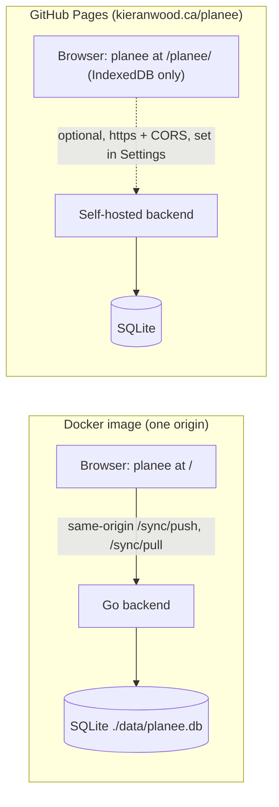

# Deploying planee

planee deploys two ways: a Docker image with the backend and frontend (below),
and a static, offline-first frontend on
[GitHub Pages](#github-pages-static-offline-first).

This project ships a container pipeline that builds a single image (the Go
backend serving the built frontend on one origin) and publishes it to the
GitHub Container Registry (GHCR).

## What gets published

`.github/workflows/docker.yaml` builds and pushes **multi-arch** images
(linux/amd64 + linux/arm64) to `ghcr.io/descent098/planee` on:

- pushes to `master` → `latest`
- git tags `v*` → `1.2.3`, `1.2`, `1` (semver)
- every build → `sha-<short>` (for pinning)

Pull requests build (to catch breakage) but do **not** push.

## One-time GitHub setup

1. Push this repo to GitHub. The owner/repo should match `descent098/planee` — GHCR
   image names must be lowercase.
2. The workflow authenticates with the built-in `GITHUB_TOKEN` (no secrets to
   add); it already declares `permissions: packages: write` so it can push.
3. After the first successful publish, the image is **private** by default. To
   let anyone `docker pull` it without logging in, open the package on GHCR and
   set its visibility to **Public** (Package settings → Danger Zone → Change
   visibility). Otherwise run `docker login ghcr.io` on the host first.

## Deploying

On any Docker host, from a folder containing `docker-compose.yml`:

```sh
docker compose up -d          # pulls ghcr.io/descent098/planee:latest
# app + sync API → http://localhost:8228, database → ./data/planee.db
```

Update later with:

```sh
docker compose pull && docker compose up -d
```

Pin to a specific release for reproducible deploys by editing the image tag in
`docker-compose.yml`, e.g. `ghcr.io/descent098/planee:v1.0.0`.

## Building from source instead

No registry needed — build the image locally:

```sh
docker compose -f docker-compose.build.yml up --build
```

## Data & backups

The SQLite database is bind-mounted to `./data` on the host, so `planee.db`
(plus its `-wal`/`-shm` files) is a real file next to the compose file —
recreating or updating the container never touches it. Back up by copying that
folder, or download a checkpointed copy from `GET /backup` on the running
server.

## GitHub Pages (static, offline-first)

`.github/workflows/pages.yaml` publishes **only the frontend**, as a static
site, to **https://kieranwood.ca/planee**. There is no backend on Pages: the app
keeps everything in the browser's IndexedDB and works offline through its
service worker.

On every push to `master` (or a manual run from the Actions tab) the workflow:

1. **test**: `npm ci`, `npm run check` (astro check + svelte-check), and
   `npm run test:unit`. The Playwright sync harness is not run here; it runs in
   `sync-tests.yml`.
2. **build**: `astro build --site https://kieranwood.ca --base /planee` with
   `PUBLIC_DEFAULT_SYNC_MODE=offline`, then uploads `frontend/dist` as the Pages
   artifact.
3. **deploy**: publishes that artifact with `actions/deploy-pages`.

### One-time setup

1. In the repo, open **Settings → Pages → Build and deployment** and set
   **Source** to **GitHub Actions**.
2. No custom domain is needed on this repo. `kieranwood.ca` is the custom
   domain of the account's GitHub Pages user site, so every project site on the
   account is served under it at `/<repo>`. That is why the build uses
   `--base /planee`. If the repo is renamed, change `--base` to match.

### Sync defaults to offline

When no URL is set, the sync URL is same-origin. On Pages, same-origin is a
static host with no `/sync` endpoints, so the Pages build is compiled with
`PUBLIC_DEFAULT_SYNC_MODE=offline` and makes no sync requests on load. The build
default only applies until the user picks a mode. A choice made in onboarding
or Settings is stored in `localStorage` and wins over it.

Settings on this build shows a note that data stays on the device until a sync
server is set.

### Connecting it to a self-hosted backend

A Pages copy can sync with a backend you run yourself (for example the Docker
image above):

- **The backend must be served over https.** The page is https, and browsers
  block requests from an https page to an `http://` server (mixed content).
  Settings warns when you enter an `http://` URL. Put the backend behind a
  TLS-terminating reverse proxy (Caddy, nginx, Traefik, Cloudflare Tunnel, and
  so on).
- **CORS is already open.** The backend sends `Access-Control-Allow-Origin: *`,
  so no server config is needed for the Pages origin.
- **The backend has no authentication.** Anyone who can reach the URL can read
  and overwrite the data. Only expose it where that is acceptable, or put auth
  in the proxy.
- In the app, go to **Settings → Sync server**, enter the server URL (for
  example `https://planee.example.com`), then press **Save**, **Test
  connection**, and **Sync enabled**.

### How it differs from the Docker image

| | Docker image | GitHub Pages |
| --- | --- | --- |
| Ships | Go backend + built frontend, one origin | Frontend only (static files) |
| URL | `http://<host>:8228/` (root) | `https://kieranwood.ca/planee/` (sub-path) |
| Sync by default | On, same-origin | Off (`PUBLIC_DEFAULT_SYNC_MODE=offline`) |
| Data | IndexedDB, synced to SQLite on the host | IndexedDB on each device until a server is set |
| Server backups | `GET /backup` | None. Use Settings → Backup → Export JSON |



### Testing a sub-path build locally

```sh
cd frontend
# build into <dir>/planee, anywhere outside the repo
PUBLIC_DEFAULT_SYNC_MODE=offline npx astro build --base /planee --outDir <dir>/planee
npx serve <dir>   # then open http://localhost:3000/planee/
```

On Windows Git Bash, prefix the build with `MSYS_NO_PATHCONV=1`. Otherwise
`--base /planee` is rewritten to `C:/Program Files/Git/planee` and every link in
the build breaks.
