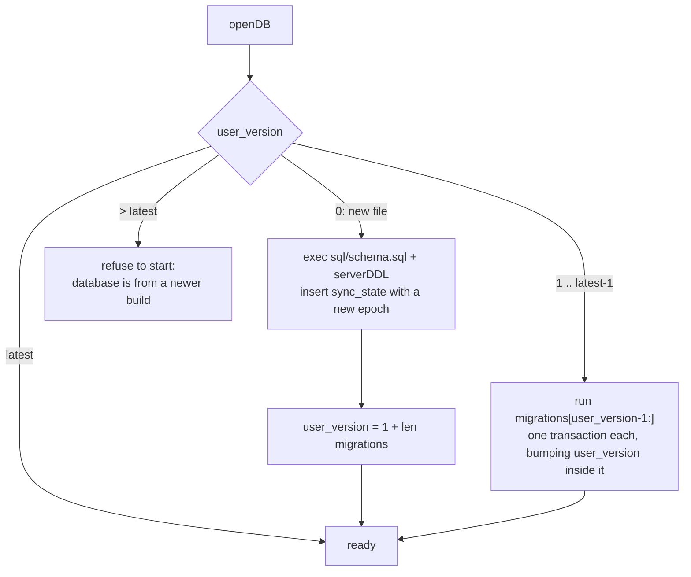

# planee backend

Go sync server for the local-first frontend. SQLite storage (pure-Go driver,
no cgo), one binary.

## Run

```sh
go run .
```

Or run the whole app (backend + frontend on one origin) with the prebuilt
image, from the repo root:

```sh
docker compose up -d          # pulls ghcr.io/descent098/planee:latest
# …or build from source: docker compose -f docker-compose.build.yml up --build
```

Images are published to `ghcr.io/descent098/planee` by
`.github/workflows/docker.yaml`; see `DEPLOYMENT.md` at the repo root.

## Environment

| Variable | Default | Purpose |
| --- | --- | --- |
| `PORT` | `8228` | HTTP listen port |
| `DB_PATH` | `planee.db` | SQLite file location |
| `STATIC_DIR` | (unset) | Serve the built frontend from this directory |

## Endpoints

| Endpoint | Purpose |
| --- | --- |
| `GET /healthz` | Liveness probe |
| `POST /sync/push` | Accept client rows; last-write-wins on `updated_at`; stamps `server_seq` |
| `GET /sync/pull?since=<seq>` | Rows with `server_seq` above the cursor (tombstones included) |
| `GET /backup` | Download the SQLite file |
| `/` | Static frontend, when `STATIC_DIR` is set |

## Sync model

- Clients generate UUID ids and stamp `updated_at` (UTC ISO 8601) on every write.
- Push: the server keeps the newer row per id (string comparison on
  `updated_at`) and assigns `server_seq` from one global counter.
- Pull: clients send their high-water `server_seq` and receive everything newer.
- Deletes are soft (`deleted_at` tombstones) so they sync like any other write.
- Enum tables (`task_type`, `status_type`) are
  reference data: `sql/schema.sql` seeds them with the same ids every client
  seeds for itself, so they are absent from `tableOrder`/`tables` in
  `sync.go` — a push naming one is refused as unknown and a pull never
  carries one. Changing a value list means a schema migration that re-runs
  the `INSERT OR IGNORE` seed and deletes dropped rows (see
  [Evolving the schema](#evolving-the-schema)).
- `project`, `version`, `task`, `version_task` and `preferences` merge **per
  field**, using the `field_updated_at` stamp map, so two devices editing
  different fields of one row both keep their edit. The server stores that map
  with exactly one stamp per column except `id`, `updated_at` and `server_seq`.
  A missing stamp is filled from the row's `updated_at`. `asset` and anything
  else not flagged `fieldMerge` is whole-row last-write-wins.

## Sync gotchas worth knowing

These are inherent to the last-write-wins + cursor design. The generated
client already handles the first three; the fourth is a product decision.

1. **Single-row (settings-style) tables must use a fixed id.** A row created
   with `withSyncFields()` gets a random UUID *per device*, so two devices make
   two non-merging rows and reads become nondeterministic. Use
   `getSingleton`/`putSingleton` from `frontend/src/lib/db/repo.ts` for any
   "one row for the whole account" table. (See the frontend README.)
2. **Switching sync servers resets local sync state.** `server_seq` values and
   the stored `lastPullSeq`/`serverEpoch` only mean anything relative to the
   server that issued them. `setSyncUrl()` calls `resetLocalSyncState()` when
   the URL changes: it drops both `sync_meta` keys, nulls every row's
   `server_seq`, and re-queues every local row, so the next sync re-pulls from
   scratch and re-pushes local data. Restoring a JSON backup in `replace` mode
   does the same. If you add another path that swaps the local dataset or
   server, call `resetLocalSyncState()` yourself — skipping either half is a
   silent permanent fork.
3. **Reactive values can't be stored directly.** IndexedDB structure-clones
   rows, and Svelte 5 `$state` proxies are unclonable (`DataCloneError`). The
   `put`/`bulkPut` helpers JSON round-trip rows (`toPlain`) so this never
   bites — keep new writes going through them rather than `getDB().put`.
4. **First connection to a server with existing data is a union-merge.** Point
   a device that already has local rows at a server that also has rows, and
   both datasets combine under last-write-wins (nothing is lost, but they
   mix). If you want to offer "keep this device / keep the server / merge"
   instead, add the `GET /sync/stats` (has-data probe) and `POST /sync/reset`
   (wipe server) endpoints to `sync.go` and drive them from onboarding —
   `resetLocalSyncState()` plus a server reset is the primitive you need.

## Evolving the schema

The schema version lives in SQLite's `PRAGMA user_version`. `openDB`
([db.go](db.go)) brings every database to the latest version on startup:



- `sql/schema.sql` is always the **full, current** DDL. A fresh database gets
  it in one go and never runs a migration.
- `migrations` in `db.go` is the ordered list of steps an **existing**
  database takes. `migrations[0]` takes v1 (the original schema, frozen in
  [`testdata/schema_v1.sql`](testdata/schema_v1.sql)) to v2, and so on.
- Each step runs in its own transaction, with `PRAGMA user_version` set inside
  it. A step that fails rolls back completely, and the next start retries it.
- Migrations never touch `sync_state`. Changing the epoch would make every
  client drop its cursor and re-pull everything.
- `foreign_keys` stays off, as it does for sync. SQLite only allows
  `ADD COLUMN ... REFERENCES` with a non-NULL default while enforcement is off.

### Adding a migration

1. Edit `sql/schema.sql` into the new full schema.
2. **Append** `migrateVN` to `migrations` in `db.go`. It takes a database from
   the previous version to exactly that schema. Never edit or reorder a step
   that has shipped: databases already past it will never run it again.
   - `ALTER TABLE ... ADD COLUMN` for new columns. A `NOT NULL` column needs
     the same `DEFAULT` as `schema.sql`, which is also what existing rows get.
   - `ALTER TABLE ... DROP COLUMN` for removed columns.
   - `CREATE TABLE` for new tables. Paste a frozen copy of the DDL; don't
     reference `schema.sql`, because it will keep changing.
   - SQLite can't change a column's type, constraint or `DEFAULT` with
     `ALTER`. Either rebuild the table (create new, copy, drop, rename, all in
     the step's transaction) or accept the difference and record it in
     `knownMigrationDifferences` in `db_test.go` with the reason. v2 does the
     latter for `task.priority`'s default: 3 on migrated databases, 4 on
     fresh ones. The client always sends `priority`, so the difference can't be
     observed through sync.
3. Update the table metadata in `sync.go` (`tableOrder`, `tables`).
4. Append the matching IndexedDB migration in `frontend/src/lib/db/db.ts`.
   It must backfill **the same defaults** onto existing client rows, without
   restamping `updated_at` or queueing a push, so rows that existed before the
   upgrade agree on both sides with no sync traffic.
5. Mirror the change in `frontend/tests/sync/helpers/schema.ts`.
6. `go test ./...`. `TestMigrateV1MatchesFresh` and `TestMigrateV2MatchesFresh`
   migrate a v1 database and one a v2 build created
   ([`testdata/schema_v2.sql`](testdata/schema_v2.sql)), and compare
   `PRAGMA table_info` and `PRAGMA foreign_key_list` for every table against a
   fresh one. Columns are compared by name, because `ADD COLUMN` appends while
   a fresh `CREATE TABLE` lists columns in schema order.
   `TestMigrateV1BackfillsExistingRows` and `TestMigrateV2BackfillsExistingRows`
   check the values existing rows end up with. Extend them when a migration
   adds or changes columns. When a schema ships, freeze it as the next
   `testdata/schema_vN.sql` (from `git show`) so later migrations are tested
   from that baseline too.

Enum value changes are migrations too: re-run the `INSERT OR IGNORE` seed (and
delete dropped values) in a new step.
