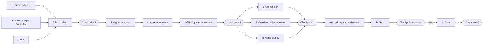
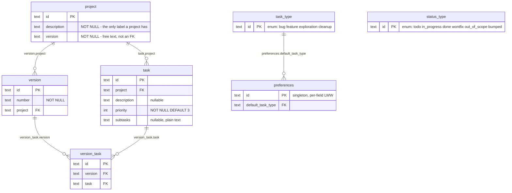
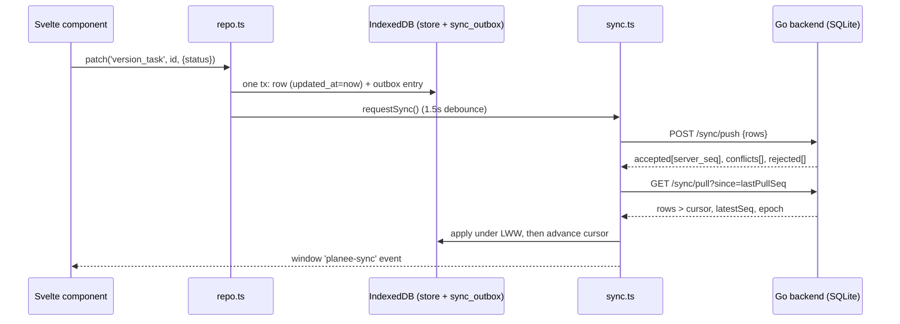
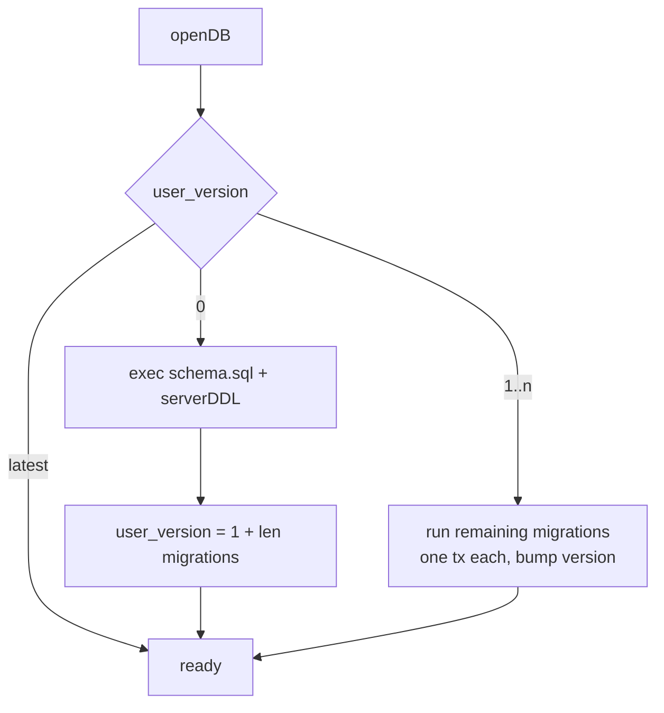
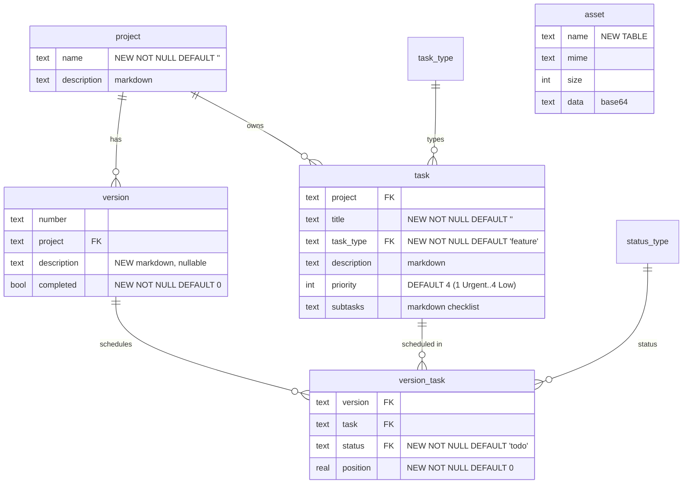
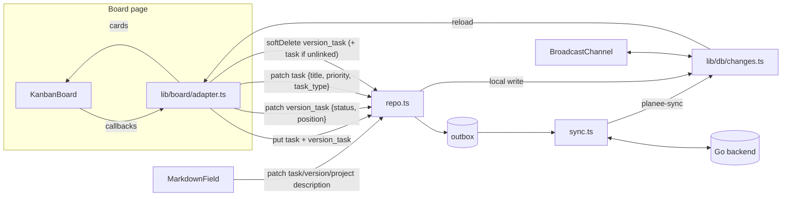

# Version 0.1.0 — phased plan

Source of truth for the work list: [`docs/dev/planning/TODO`](../planning/TODO).
This file breaks that list into phases and checkpoints. **If you are an agent
picking this up, read [Progress](#progress) first and resume from the first
unchecked item.** Tick boxes as you go and commit this file with the work.

- VERSION: `0.1.0` — matches the topmost `0.1.0 (unreleased)` heading in
  `CHANGELOG.md`, so no bump is needed. Every phase adds its entries under that
  heading (Features / Bug Fixes / Other).
- Work happens on branch `version-0.1.0`. Commit at every checkpoint.
- Baseline taken 2026-09-13: `npx astro check` → 0 errors, 0 warnings. Git has
  one commit (`231a592 initial files`) and **no remote**.
- **Scope for this pass (per the human): Phases 1–10, stopping after
  Checkpoint 4.** Phase 11 (docs) and Checkpoint 5 come later.

## Progress

- [x] Phase 0 — Exploration, questions answered, this plan
- [x] Phase 1 — Dependency updates (frontend / backend / CI) *(parallel)*
- [x] Phase 2 — Test tooling baseline
- [x] **Checkpoint 1** — full suite green on the updated baseline → commit
- [x] Phase 3 — Backend schema-migration runner
- [x] Phase 4 — Data model changes (lockstep)
- [x] Phase 5 — Generated CRUD pages + sync harness cases for the new schema
- [x] **Checkpoint 2** → commit
- [ ] Phase 6 — Port the kanban board from retoken *(parallel with 7 and 8)*
- [ ] Phase 7 — Port retoken's markdown editor + preview, synced asset store *(parallel with 6 and 8)*
- [ ] Phase 8 — GitHub Pages deploy *(parallel with 6 and 7)*
- [ ] **Checkpoint 3** → commit
- [ ] Phase 9 — Board page, version completion, markdown fields everywhere (frontend ⇄ backend persistence)
- [ ] Phase 10 — Board and markdown tests: two-device sync and real UI
- [ ] **Checkpoint 4** → commit, then **stop**
- [ ] Phase 11 — Documentation (dev + user), CHANGELOG review, TODO close-out *(later)*
- [ ] **Checkpoint 5 (final)** *(later)*



## The full test suite (what "run the checkpoint" means)

Run from the repo root. Every command must pass, with no retries and no
skipped suites. The sync harness's trust gate reports a filtered run as
`NOT TRUSTWORTHY`, and that counts as a failure.

```sh
cd backend  && go vet ./... && go test ./...
cd frontend && npm run check            # astro check + svelte-check (errors fail; .svelte files are NOT covered by astro check)
cd frontend && npm run test:unit        # exists from Phase 2
cd frontend && npm run test:sync        # builds frontend + backend itself (global-setup.ts)
docker build .                          # only if Docker is available locally; otherwise note it was skipped
```

Between checkpoints, run just the part you touched. Examples:
`PLANEE_SKIP_BUILD=1 npx playwright test tests/sync/field-matrix.spec.ts`, or
`npm run test:unit -- board`. `PLANEE_SKIP_BUILD=1` is a local shortcut only
([global-setup.ts:17](../../../frontend/tests/sync/global-setup.ts)).
**Never** use it at a checkpoint.

**Subagents.** Phases marked *(parallel)* touch disjoint files, and each lists
the files it owns. Subagents must not edit `CHANGELOG.md` or this plan; they
report their CHANGELOG lines and the main agent merges them. Checkpoint runs
stay on the main agent: the sync harness uses one server and `workers: 1`
([playwright.config.ts](../../../frontend/playwright.config.ts)), so two
harness runs at once would collide.

---

## Phase 0 findings — the data model as generated

This is what `local-sync-template` produced.



Every synced row also has `id`, `updated_at` (LWW), `deleted_at` (tombstone)
and `server_seq` (the pull cursor). See the header of
[schema.sql:8-27](../../../backend/sql/schema.sql).

| Layer | Where | Notes |
| --- | --- | --- |
| DDL | [backend/sql/schema.sql](../../../backend/sql/schema.sql) | Applied **only** when `PRAGMA user_version = 0` ([db.go:56-77](../../../backend/db.go)). There is no path for migrating an existing DB. |
| Server sync metadata | [backend/sync.go:52-77](../../../backend/sync.go) | `tableOrder` + `tables` (`boolCols`/`jsonCols`/`fieldMerge`). Enums are absent. |
| Push / pull | [sync.go:302](../../../backend/sync.go) `handlePush`, [sync.go:427](../../../backend/sync.go) `handlePull` | Whole-row LWW (strictly newer wins), or per-field ([sync.go:273](../../../backend/sync.go) `mergeFields`). |
| Client types | [frontend/src/lib/db/types.ts](../../../frontend/src/lib/db/types.ts) | `STORES` at lines 79-87. Every `indexes: []` is empty. |
| IndexedDB migrations | [frontend/src/lib/db/db.ts:42-64](../../../frontend/src/lib/db/db.ts) | v1 creates stores **and indexes from the current `STORES` map**. v2 adds `sync_meta` and `sync_outbox`. |
| Write path | [frontend/src/lib/db/repo.ts](../../../frontend/src/lib/db/repo.ts) | `patch` is the default edit. Every write enqueues and calls `requestSync()`. |
| Sync loop | [frontend/src/lib/sync.ts](../../../frontend/src/lib/sync.ts) | `syncNow` (309), `requestSync` (487), `SYNC_EVENT` (46), same-origin default URL (73-80). |
| Harness schema mirror | [frontend/tests/sync/helpers/schema.ts](../../../frontend/tests/sync/helpers/schema.ts) | Drives `field-matrix.spec.ts`. |



Gaps found (each is resolved by a decision below):

1. `task` has no title, status, type or order.
2. `status_type` is not referenced by anything; `task_type` is referenced only
   by `preferences.default_task_type`.
3. Only `preferences` merges per field, so a drag on one device and a text edit
   on another lose one of the two changes.
4. No IndexedDB indexes. **Trap:** v1 builds indexes from the *current*
   `STORES` map ([db.ts:46-51](../../../frontend/src/lib/db/db.ts)), so a new
   migration must guard `createIndex` with `indexNames.contains`, or fresh
   installs throw `ConstraintError`.
5. The server cannot migrate an existing DB.
6. `project` has no name; `project.version` is free text overlapping `version`.
7. **Bug:** TaskApp "Create & link" makes a `version` with `project: ''`
   ([TaskApp.svelte:53](../../../frontend/src/components/apps/TaskApp.svelte)).
8. HomeApp still shows the retemplate showcase hero with dead links
   ([HomeApp.svelte:26-37](../../../frontend/src/components/apps/HomeApp.svelte)).
9. With no URL set, a GitHub Pages build syncs against the static host
   ([sync.ts:79](../../../frontend/src/lib/sync.ts)).

---

## Decisions (answered by the human, 2026-09-13)

Model: **project → versions → tasks of various types.**

| # | Decision |
| --- | --- |
| D1 | Keep `version_task`. `status` and `position` live on it, so each version keeps its own history. **Bump** marks the old link `bumped` and adds a `todo` link in the next version. |
| D2 | The board has **3 columns: TODO, In Progress, Done.** `wontfix`, `out_of_scope` and `bumped` count as done and sit in the Done column. Dragging a card to Done sets `done`; a resolution badge/dropdown (on the card and in its dialog) switches it to one of the other three. |
| D3 | **Current version = the oldest incomplete version** by semver. `project.version` is removed. Completed versions are reachable from a "Completed versions" switcher. |
| D4 | New fields: `project.name`, `task.title`, `version.description`, `task.task_type` (default from `preferences.default_task_type`), and `version.completed` (a boolean, with UI). |
| D5 | Marking a version complete while it has open (todo/in-progress) tasks shows an offer to bump them to the next version, creating it if needed, or to complete anyway. |
| D6 | Completed versions are **read-only** on the board (no drag, create or edit) until you press "Reopen version". |
| D7 | **Every description field is markdown** (`project.description`, `version.description`, `task.description`, plus `task.subtasks`, used as a checklist). It renders normally and only shows the editor while being edited. |
| D8 | Markdown is **the full retoken editor**: Milkdown WYSIWYG plus a Source tab, GFM, footnotes, mermaid (with diagram dialog), Shiki code highlighting, KaTeX math, and Excalidraw drawings. Output is **sanitised** (retoken's pipeline is not). |
| D9 | Images and drawings go in a new **synced `asset` table** (base64 TEXT; per-asset cap 5 MB). Markdown references them as `assets/<uuid>.<ext>`, with drawings as `assets/<uuid>.excalidraw.png`. |
| D10 | Editing uses **explicit Save/Cancel**. Save calls `repo.patch` once. If the field changed on another device during the edit, warn before overwriting. |
| D11 | Offline: **trim, then precache everything.** Shiki and CodeMirror languages are cut to a shortlist, KaTeX ships woff2 only, and Excalidraw locales are dropped. `WARM_MAX_ASSETS` is raised to fit the measured build. |
| D12 | The GitHub Pages build lives at `https://kieranwood.ca/planee` and defaults to **offline** mode. Settings warns about https→http mixed content. |
| D13 | Home lists projects (name, current version, open count) and links to `/board/?project=…`. The board opens on the current version, with a completed-versions switcher. |
| D14 | Excalidraw fonts: self-host **Excalifont, Nunito and Cascadia** (woff2) and set `EXCALIDRAW_ASSET_PATH`. |
| D15 | Priority: **1 Urgent, 2 High, 3 Medium, 4 Low**, with **4 as the default**. |

---

## Phase 1 — Dependency updates *(parallel: 3 subagents)*

State on 2026-09-13:

- Frontend: `npm outdated` → only `typescript 6.0.3 → 7.0.2`.
- Backend: `modernc.org/sqlite v1.58.0` is current, with some indirect updates.
- Local Go is 1.24.5; `go.mod` says `go 1.25.0`.

### 1a Frontend — owns `frontend/package.json`, `frontend/package-lock.json`

- [ ] `npm outdated` / `npm audit`; update everything within its major.
- [ ] Try TypeScript 7. Keep it only if `astro check` and `build` pass;
      otherwise stay on `^6` and record why.
- [ ] Check that the lockfile works with Linux `npm ci` (local-sync-template
      hit npm dropping `@emnapi/*` optional deps). If this can't be verified
      locally, flag it.

### 1b Backend — owns `backend/go.mod`, `backend/go.sum`, `Dockerfile`

- [ ] `go get -u ./... && go mod tidy`. **Do not bump `modernc.org/libc`
      separately**; sqlite needs an exact version.
- [ ] Keep `go 1.25.0`; confirm the local build works through toolchain
      download.
- [ ] Dockerfile base images: current `node:24-alpine`,
      `golang:1.25-alpine`, and an Alpine stable newer than `3.20`.

### 1c CI — owns `.github/workflows/*`

- [ ] `docker.yaml`: confirm action majors are current.
- [ ] Add `sync-tests.yml`, modelled on readerr's: PR path filters plus
      `workflow_dispatch`; node 24; setup-go with `go-version-file`;
      `npm ci`, playwright chromium, `astro check`, `test:unit`, `test:sync`;
      `go vet` / `go test`; upload traces on failure.

## Phase 2 — Test tooling baseline

- [ ] Vitest (`vitest.config.ts`, node environment, `src/**/*.test.ts`) and
      `"test:unit": "vitest run"`.
- [ ] `backend/db_test.go` smoke test (temp DB, `user_version`, seeded enums).
- [ ] `frontend/README.md` › Test: the suite commands.

### ✅ Checkpoint 1

Full suite, then commit "Update dependencies and add unit test tooling".

---

## Phase 3 — Backend schema-migration runner

Owns `backend/db.go`, `backend/db_test.go`, `backend/testdata/`, `backend/README.md`.

- [ ] `schema.sql` stays the canonical full DDL for fresh databases.
- [ ] `var migrations []func(*sql.Tx) error`:
  - fresh DB → apply the DDL, then `user_version = 1 + len(migrations)`
  - existing DB → run `migrations[user_version-1:]`, one tx each, bumping
    `user_version`
- [ ] Tests: fresh reaches latest; a v1 DB (fixture
      `backend/testdata/schema_v1.sql`, the original DDL) migrates to
      columns identical to fresh (`PRAGMA table_info` per table); reopening
      is a no-op.



## Phase 4 — Data model changes (lockstep, single agent)



- `project.version` is **dropped**.
- `project`, `version`, `task` and `version_task` become **fieldMerge**
  (they gain `field_updated_at`). `asset` stays whole-row, since assets are
  effectively immutable (a drawing re-save replaces the whole row).

Checklist (TODO › Per change, all together):

- [ ] `backend/sql/schema.sql`: the new DDL, including the `asset` table.
      `task.priority DEFAULT 4`.
- [ ] `backend/db.go`: migration v2.
  - `ADD COLUMN` for each new column plus `field_updated_at`.
  - `DROP COLUMN project.version`.
  - `CREATE TABLE asset`.
  - The priority default on existing DBs can't be changed with `ALTER`. The
    client always sends `priority`, so leave a comment rather than rebuilding
    the table.
- [ ] `backend/sync.go`: `tableOrder` (+`asset`, after `task`); columns;
      `boolCols: set("completed")` on `version`; `fieldMerge: true` on the
      four tables.
- [ ] `frontend/src/lib/db/types.ts`: interfaces; `STORES` (fieldMerge flags;
      indexes `version.project`, `task.project`, `version_task.version`,
      `version_task.task`; `asset`); `PRIORITY_VALUES`; `DONE_STATUSES`.
- [ ] `frontend/src/lib/db/db.ts`: **append** migration v3.
  - Create the `asset` store if missing.
  - Create missing indexes, guarded.
  - Backfill defaults on existing rows **without** changing `updated_at` and
    without enqueueing, using the same values as the server's `DEFAULT`s:
    `project.name = ''`, delete `project.version`; `version.completed = false`,
    `version.description = null`; `task.title = ''`, `task.task_type =
    'feature'`; `version_task.status = 'todo'`, `position = 0`;
    `field_updated_at = {}`.
- [ ] `frontend/tests/sync/helpers/schema.ts`: mirror all of the above. FK
      columns into enum tables must sample seeded keys.
- [ ] `backend/cmd/dbdump`: confirm it's generic over the new columns.
- [ ] New table wiring: `frontend/src/pages/asset.astro` +
      `components/apps/AssetApp.svelte` (a gallery with name, size and
      preview, delete, and "unused" detection by scanning markdown fields),
      a Navbar link, and `'asset/'` in `SHELL` in `sw.js` (bump its cache
      name).

## Phase 5 — CRUD pages + harness cases

- [ ] ProjectApp: name column/input; remove `version`.
- [ ] VersionApp: description, completed checkbox.
- [ ] TaskApp: title, task_type (default from preferences), priority
      select (D15); **fix finding 7**.
- [ ] VersionTaskApp: status select, position.
- [ ] (Markdown editors replace plain inputs in Phase 9.)
- [ ] Harness cases (`tests/sync/board-model.spec.ts`):
  - [ ] Concurrent `version_task.status` (A) + `position` (B): both survive
        on all four legs.
  - [ ] Concurrent `task.title` (A) + `task.description` (B): both survive.
  - [ ] `version.completed` boolean round-trips type-exactly (`true`, not `1`).
  - [ ] Migration backfill: a v2-shaped row injected with `rawPut` and a
        reload converge with **no** spurious push (isolated delta).
  - [ ] Float `position` round-trips exactly (`0.30000000000000004`,
        `-1.5`, `1e-7`).
  - [ ] A ~1 MB `asset` row pushes and pulls intact.
- [ ] Sabotage: "server treats `version_task` as whole-row LWW" must go red.
- [ ] CHANGELOG entries.

### ✅ Checkpoint 2

Full suite, then commit "Schema: names, task types, per-version status/position, version completion, assets".

---

## Phase 6 — Port the kanban board *(parallel with 7 and 8)*

Source: `../retoken` at `af25bc6` (Svelte 5 runes, no DnD library). Planee's
CSS already has every token and class it uses.

Owns `frontend/src/components/kanban/**` and `frontend/src/lib/kanban/**`. No
dependency changes. The description render goes through
`frontend/src/components/markdown/MarkdownPreview.svelte`, which the main agent
stubs before launch and Phase 7 replaces.

- [ ] Copy `lib/kanban/{types,board,dates}.ts` and their `.test.ts` files;
      `KanbanBoard.svelte`; `kanban/{KanbanCard,CardForm,CardDialog,CardDescription}.svelte`.
- [ ] 3 columns, with `match` routing the resolutions into Done (D2).
      **Check** what `planMove` / `toCardPatch` write when a card is reordered
      *within* Done: it must not overwrite `wontfix` with `done`. Add a unit
      test.
- [ ] Generic extension points, used by Phase 9:
  - a card badge slot or prop (task type, resolution, subtasks `n/m`)
  - a dialog actions slot (Bump, resolution select)
  - a `readonly` prop that disables drag, create and edit (D6)
  - a way to replace the dialog's description rendering and editing with the
    markdown field (D7, D10)
- [ ] Unit tests pass under `npm run test:unit`.

## Phase 7 — Markdown editor, preview and synced assets *(parallel with 6 and 8)*

Owns `frontend/package.json` / lockfile, `frontend/src/components/markdown/**`,
`frontend/src/lib/markdown/**`, `frontend/src/lib/excalidraw.ts`,
`frontend/src/lib/assets.ts`, `frontend/public/excalidraw/**`,
`frontend/public/sw.js` (the cap only), `frontend/astro.config.mjs`, and the
markdown sections of `frontend/src/styles/global.css`.

- [ ] Port `MarkdownEditor.svelte`, `MarkdownPreview.svelte`,
      `DiagramDialog.svelte`, `DrawingDialog.svelte`, `FootnoteDialog.svelte`,
      `lib/excalidraw.ts`, `lib/assets.ts`, and
      `lib/markdown/{render,mermaid,footnotes,code-languages}.ts` with
      `footnotes.test.ts`; plus `isDarkScheme`.
- [ ] Dependencies: retoken's list, plus `@milkdown/prose` declared
      explicitly and `rehype-sanitize`. Pin `clsx@^2` as a dev dependency
      (Excalidraw hoisting).
- [ ] **Sanitise**: `rehype-sanitize` after `remark-rehype`, with a schema
      that allows KaTeX, Shiki classes and styles, footnote ids/`data-*`,
      and `pre.mermaid`. Emit mermaid as a hast element, not raw HTML. Set
      mermaid `securityLevel: 'strict'` explicitly. Unit tests:
      ``, `javascript:` links and `<script>` are stripped, and
      math, code and footnotes survive.
- [ ] **Trim (D11):**
  - Shiki via `@shikijs/rehype/core` + `createHighlighterCore` with the JS
    regex engine, and CodeMirror languages from a shared shortlist
    (ts, js, svelte, astro, html, css, json, yaml, toml, markdown, bash/sh,
    go, sql, python, rust, diff, dockerfile, ini, xml, plus mermaid)
  - KaTeX woff2 only
  - Excalidraw locale chunks excluded where the bundler allows
- [ ] **Asset store (D9)** in `lib/assets.ts` as `dbAssets()`:
  - `save` writes an `asset` row via `repo.put` and returns
    `assets/<uuid>.<ext>`
  - `replace` patches `data`
  - `load` returns a Blob from the row
  - `resolve` stays synchronous from a preloaded object-URL cache;
    `preloadAssets(markdown)` scans refs before render
  - reject files over 5 MB with a visible message
- [ ] Excalidraw fonts (D14): copy Excalifont, Nunito and Cascadia woff2 into
      `public/excalidraw/fonts/…`, and set `window.EXCALIDRAW_ASSET_PATH`
      through `href()`.
- [ ] `MarkdownField.svelte` (D7/D10), the one component every description
      uses:
  - props `value`, `onSave(md) => Promise`, `readonly`, `placeholder`,
    `label`
  - it renders `MarkdownPreview` and shows an **Edit** button
  - Edit mounts `MarkdownEditor` (lazy import) with Save/Cancel
  - `getFresh?: () => Promise<string>`: on Save, compare it with the value
    at edit start and ask before overwriting a remote change
- [ ] Measure after `npm run build`: count `dist/_astro/*` plus fonts, and set
      `WARM_MAX_ASSETS` to that count plus ~25% headroom (D11). Bump the
      sw.js cache name.

## Phase 8 — GitHub Pages deploy *(parallel with 6 and 7)*

Retemplate's `pages.yml` publishes a no-build repo root, which is wrong for
planee. The template that fits is `local-sync-template/.github/workflows/astro.yaml`,
adapted as in readerr for a `frontend/` subfolder.

Owns `.github/workflows/pages.yaml`, `frontend/src/lib/sync.ts` (sync-mode
default), `frontend/src/components/apps/SettingsApp.svelte`, `DEPLOYMENT.md`.

- [ ] `pages.yaml`:
  - `BUILD_PATH: ./frontend`, branch `master`, node 24
  - a `test` job (`npm ci`, `astro check`, `test:unit`)
  - a `build` job: `astro build --site https://kieranwood.ca --base /planee`
    with `PUBLIC_DEFAULT_SYNC_MODE: offline`
  - upload-pages-artifact@v5, deploy-pages@v5
- [ ] `getSyncMode()` falls back to `import.meta.env.PUBLIC_DEFAULT_SYNC_MODE`
      when localStorage is empty (plus a unit test).
- [ ] Settings: a mixed-content warning; a note when the build is a
      sub-path/offline build.
- [ ] Verify with `astro build --base /planee` served under `/planee/`:
      pages load, offline reload works, and there are no absolute links.
- [ ] `DEPLOYMENT.md` › GitHub Pages section.

### ✅ Checkpoint 3

Merge 6, 7 and 8, then run the full suite and commit "Port kanban board and markdown editor; GitHub Pages deploy".

---

## Phase 9 — Board page, versions and markdown everywhere



- [ ] `lib/db/changes.ts`: `notifyChanged(stores)` from repo writes, the sync
      event, a BroadcastChannel, and `onChanged(stores, cb)`. Handlers only
      read.
- [ ] `lib/board/adapter.ts`, pure and unit-tested:
  - **Card mapping:** `version_task` ⋈ `task`.
  - **`onUpdate`** splits the patch: `status`/`order` → `version_task`,
    everything else → `task`. Always `patch`.
  - **`onCreate`:** `task` (task_type from preferences, priority 4), then
    `version_task` at the top of the column.
  - **`onDelete`:** soft-delete the link, and the task if it has no other
    live link.
  - **`bump(link)`** (D1) and **`completeVersion(version)`** (D5).
  - **Helpers:** `currentVersion(project)` (D3, semver) and `isDone(status)`.
- [ ] `/board/` page + `BoardApp.svelte`:
  - project picker; version switcher (current + "Completed versions")
  - version description as a `MarkdownField`
  - "Mark complete" (D5 dialog) / "Reopen" (D6)
  - an "Unscheduled tasks" drawer
  - resolution badges (D2)
  - a sync pill (pending count, last error) with "Sync now"
  - Navbar link and `'board/'` in `SHELL`
- [ ] Home (D13): project cards with inline project creation; the CRUD tiles
      move below. Remove the showcase hero.
- [ ] Replace description/subtasks inputs with `MarkdownField` in ProjectApp,
      VersionApp, TaskApp and the card dialog (D7).
- [ ] Unit tests: adapter patch splitting, create payloads, semver
      next/current version (`0.9.0 < 0.10.0`), done-resolution preserved
      when reordering in Done, bump and complete logic.

## Phase 10 — Board and markdown tests

- [ ] UI, one device:
  - create a card through the composer, drag todo → in progress with real
    pointer events, reload, and check IndexedDB plus the outbox
  - `syncNow`, and the server dump shows it
- [ ] UI, two devices: A drags to Done while B edits the title; they converge
      on all four legs with an isolated delta.
- [ ] Change feed: B's open board updates after B's sync without a reload.
- [ ] Resolution: set `wontfix` in the dialog, reorder within Done, and the
      status is still `wontfix`.
- [ ] Bump / complete-with-open-tasks flows converge; a completed version's
      board refuses drag.
- [ ] Markdown: edit a task description through the UI (Source tab), Save,
      and it renders sanitised on device B after sync. A remote change during
      an edit triggers the overwrite warning.
- [ ] Asset: save a small PNG through `dbAssets().save` from the UI context;
      device B's preview resolves it after sync.
- [ ] Sabotage: "adapter writes via `put` from the UI snapshot" goes red.

### ✅ Checkpoint 4

Full suite, plus a manual sanity pass if possible. Commit "Kanban board with persistent sync, versions and markdown fields". **Stop here.**

---

## Phase 11 — Documentation *(later)*

Dev docs with mermaid diagrams and code references: `data-model.md`,
`sync.md`, `kanban.md`, `markdown.md`, `deployment.md`. User docs cover the
board, versions, markdown and drawings. Update the README Tables section and
check the CHANGELOG.

### ✅ Checkpoint 5 *(later)*
